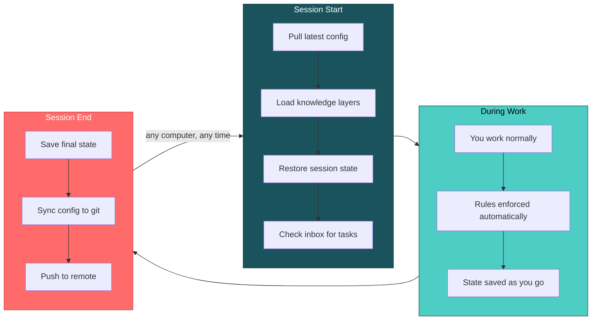
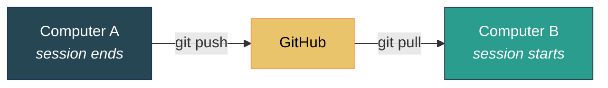

# Agent Fleet

A persistent, multi-project, multi-machine AI agent that manages your development infrastructure through conversation.

## Install, Launch, Talk

```bash
git clone https://github.com/YOUR_USERNAME/agent-fleet ~/agent-fleet
cd ~/agent-fleet && bash setup.sh
```

Launch Claude Code. The agent introduces itself and asks how you work -- your projects, your communication style, your tools. No forms. No config files. Just a conversation. Everything after this point is "tell the agent what you need."

For a more detailed walkthrough, see the [Onboarding Guide](docs/onboarding-guide.md).

---

## Quick Start

### Prerequisites

- Linux, macOS, or Windows with WSL
- [Claude Code](https://docs.anthropic.com/en/docs/claude-code/getting-started) installed
- git and Node.js 18+ installed
- Python 3 (optional, recommended)

**Windows users:** Claude Code runs inside WSL. If you haven't set it up: PowerShell as Admin, `wsl --install`, restart, open the Ubuntu app. Everything below happens in that terminal.

### Five minutes to a working agent

**1. Fork and clone**

```bash
git clone https://github.com/YOUR_USERNAME/agent-fleet ~/agent-fleet
cd ~/agent-fleet
bash setup.sh
```

The script detects your OS, installs dependencies, creates symlinks, and sets up session hooks. It asks about integrations (GitHub, Gmail, Jira) -- skip any you don't need.

**2. Set up credentials** (optional)

Copy `setup/setup/secrets/vault.json.example` to `setup/secrets/vault.json`, add your tokens, then encrypt:

```bash
bash setup/secrets/vault-manage.sh encrypt
```

Or configure MCP servers manually in `~/.mcp.json`. Or skip this entirely and tell the agent to set up integrations later.

**3. Launch and talk**

```bash
claude
```

On first launch, the agent detects a `.setup-pending` marker and starts onboarding -- a conversation about who you are, what you work on, and how you want the agent to behave. It writes everything to the right config files. You can change any of it later by just telling the agent.

Every session after the first is automatic: pull latest config, load project knowledge, restore state, check for cross-project tasks.

---

## Three Shortcuts

```
lsd     project dashboard
cls     clean shutdown, then /clear
end     clean shutdown, then exit
```

Type any of these as your entire message. `cls` and `end` run the full shutdown protocol -- save state, archive session, commit, push -- so you never lose work. `lsd` shows a priority-grouped dashboard with task counts and disk sizes, rendered from cache built at each shutdown.

These are shortcuts, not the interface. The interface is conversation.

---

## Common Things You Can Say

| You say | What happens |
|---------|-------------|
| "Set up this project" | Creates config, adds to registry, initializes session tracking |
| "Switch to my other project" | Archives current state, opens a new tab in the target project |
| "Add GitHub integration" | Configures the MCP server, walks you through credentials |
| "Show me the backlog" | Reads and displays prioritized tasks for the current project |
| "Pass this task to the infra project" | Drops it in the cross-project inbox -- picked up at next session start |
| "What happened last session?" | Reads session history and summarizes |
| "Deploy my config to the other machine" | Commits, pushes; the other machine auto-pulls on next launch |
| "Always use bun instead of npm in this project" | Adds a permanent rule to the project config |
| "Something's wrong with the GitHub MCP server" | Diagnoses the issue -- checks config, tokens, permissions, whitelist |
| "Prepare for shutdown" | Runs the full 7-step shutdown checklist without being asked twice |

The agent knows about all your projects (via the registry), all your machines (via machine files), and all cross-project state (via the inbox and strategy files). You don't need to memorize paths or commands.

---

## First-Run Onboarding

On first launch after setup, the agent starts a conversation:

- **Who you are** -- name, role, what you work on
- **Communication style** -- concise or verbose, formal or casual, humor preferences
- **Personas** -- optionally define multiple personalities (e.g., a focused workhorse by default, a warmer voice when you're frustrated). Each has a name, traits, and a natural-language activation rule
- **Integrations** -- which external services to connect (GitHub, Gmail, Jira, etc.)
- **Projects** -- what you're working on, where the repos live

The agent writes everything to the correct config files. Nothing is permanent -- tell the agent to change anything, anytime.

---

## How It Works

You don't need to understand this to use it. But if you're curious:

### Knowledge Layers


The agent doesn't load everything at once. A coding project loads TDD rules. An infrastructure project loads server protocols. This keeps the agent fast, focused, and leaves room in the context window for actual work.

### Session Persistence

The agent maintains `session-context.md` in every project directory. It tracks what's in progress, what's done, and how to resume if the session terminates unexpectedly.

| Protection | How |
|-----------|-----|
| **Continuous archival** | SessionEnd hooks auto-rotate state to history -- even on `/clear`, crashes, or unexpected exits |
| **Unclean shutdown detection** | SessionStart hooks detect when the previous session didn't shut down properly and warn the agent to review what was lost |
| **Config health check** | SessionStart hooks validate symlinks, auto-pull if behind remote, clean stale permissions |
| **Cross-project commit** | Session files in the current project get committed automatically at session end |
| **Live context meter** | Status line shows model, context usage %, and kilotokens -- color-coded so you know when to wrap up |

### Session Flow



### Cross-Project Coordination

Projects communicate through `cross-project/inbox.md`. When one project needs another to act, the agent drops a task in the inbox. The target project picks it up automatically at next startup.

Direct file writes between projects are forbidden -- the inbox keeps projects decoupled and prevents silent data corruption.

### Multi-Persona System

Define multiple named personalities with automatic context-based switching:

- **Name** -- displayed as a bold prefix on responses (e.g., `**Atlas:**`)
- **Traits** -- comma-separated style descriptors (efficient, dry-humor, warm, etc.)
- **Activation rule** -- natural language (e.g., "when user is frustrated", "when discussing architecture")
- **Style** -- free-text description of communication approach

The default persona activates at session start. Others switch in when the agent detects a matching condition. You can force a switch by saying "switch to [Name]."

Personas are defined in `global/foundation/personas.md`. Machine-specific overrides go in that machine's config file. The setup onboarding offers to configure them conversationally.

---

## Mobile Access

Access your agent fleet from a phone or tablet through a lightweight, read-only repo:

```bash
# On any full machine:
bash sync.sh mobile-deploy
```

This creates `~/agent-fleet-mobile/` with:
- **Read-only snapshots** of your projects, dashboard, and registry
- **An outbox** (`inbox/outbox.md`) — the only writable file
- **A minimal CLAUDE.md** — no startup checklist, no hooks, instant-on

Post tasks from mobile and they flow back automatically:

```
Mobile → outbox.md → sync.sh mobile-collect → cross-project inbox → target project
```

The `mobile-collect` step runs automatically at session end on any full machine. Or run it manually: `bash sync.sh mobile-collect`.

Mobile mode is intentionally limited. It reads, it captures tasks, and it answers questions. It can't edit config, run deployments, or modify project source. This prevents multi-device conflicts while giving you full visibility into your system from anywhere.

---

## Adding a Second Machine

```bash
git clone YOUR_REPO_URL ~/agent-fleet
cd ~/agent-fleet && bash setup.sh
```

Same two commands. The agent detects the new machine, creates a machine-specific config file, and everything syncs from there. Or tell the agent "help me set up my other machine" and it walks you through it.



No computer is special. Each machine gets its own file in `global/machines/`. Conflicts are rare because each machine writes to its own config and session-context is per-session.

| Syncs via git | Stays local |
|---------------|-------------|
| Rules, knowledge, session history | API tokens (`~/.mcp.json`) |
| Project configs, backlogs | OAuth credentials |
| Cross-project inbox | Machine-specific tool paths |

---

## What's in the Box

### Directory Structure

```
agent-fleet/
|
|-- setup.sh                       Run once -- sets everything up
|-- sync.sh                        Config sync (automated by hooks)
|-- registry.md                    All your projects
|
|-- global/
|   |-- CLAUDE.md                  The main prompt (the "dispatcher")
|   |-- foundation/                Session protocol, identity, personas
|   |-- domains/                   Topic rules (coding, infra, publishing)
|   |-- reference/                 Tool guides, troubleshooting
|   |-- knowledge/                 Operational tips and workarounds
|   |-- machines/                  Per-computer configuration
|   `-- hooks/                     SessionStart/End automation
|
|-- tests/
|   |-- run.sh                     Test runner
|   `-- test_*.sh                  Individual suites
|
|-- setup/
|   |-- install-base.sh            Phase 1: system deps, Node.js
|   |-- configure-claude.sh        Phase 2: MCP, launchers, hooks
|   |-- lib.sh                     Shared utilities (multi-distro detection)
|   |-- config/                    Template configs
|   `-- scripts/                   Operational scripts (rotation, dashboard, etc.)
|
|-- projects/
|   `-- _example/rules/CLAUDE.md   Example project config
|
`-- cross-project/
    |-- inbox.md                   Task passing between projects
    `-- *-strategy.md              Shared state files
```

### Sync Tool

| Command | What it does |
|---------|-------------|
| `bash sync.sh setup` | Run once per computer. Creates symlinks, installs hooks. |
| `bash sync.sh deploy` | Push config changes to live locations. Safe to repeat. |
| `bash sync.sh collect` | Pull changes from live locations back into the repo. |
| `bash sync.sh status` | Health check -- shows what's linked, what's out of sync. |

You rarely need to run these manually. The session hooks handle sync automatically. But they're there if you want direct control.

### MCP Servers

MCP servers let the agent interact with external services. All are optional -- configure during setup or tell the agent to add them later.

| Server | What it does | Needs credentials? |
|--------|-------------|:------------------:|
| **GitHub** | Manage repos, issues, pull requests | Yes (PAT) |
| **Google Workspace** | Gmail, Google Docs, Calendar, Drive | Yes (OAuth) |
| **Twitter/X** | Post tweets | Yes (API keys) |
| **Jira** | Issues, sprints, Confluence | Yes (API token) |
| **PostgreSQL** | Database queries | Yes (connection URL) |
| **LinkedIn** | Create posts | Yes (OAuth, manual setup) |
| **Serena** | Semantic code navigation | No |
| **Playwright** | Browser automation, screenshots | No |
| **Memory** | Persistent knowledge graph | No |
| **Diagram** | Mermaid diagram generation (PNG/SVG/PDF) | No |

### Domains

Domains are topic-specific rule sets. Each project declares which ones it needs.

| Domain | What it teaches the agent |
|--------|--------------------------|
| **Software Development** | TDD, code review conventions |
| **Publications** | Markdown-to-PDF pipeline, content quality |
| **Engagement** | Community interaction, social media etiquette |
| **IT Infrastructure** | Server management, Docker, DNS, deployment |

Add your own: copy `global/domains/_template/`, edit it, reference it from your project's CLAUDE.md.

### Operational Knowledge

`global/knowledge/` stores tool-specific tips, workarounds, and troubleshooting recipes. Unlike domains (broad rule sets declared per-project), knowledge files are narrow and actionable, growing organically from real debugging sessions. They load conditionally when the relevant tool or situation is encountered.

### Test Suite

125 tests across 10 suites, run via `tests/run.sh`:

| Suite | Tests | Covers |
|-------|------:|--------|
| harness | 13 | Test runner itself |
| rotate-session | 19 | Session archival, history rotation, template parsing |
| git-sync-check | 10 | Remote detection, fast-forward, divergence handling |
| sync | 10 | Deploy, collect, symlinks, hook copying |
| persona | 6 | Persona file parsing, switching logic |
| lsd-refresh | 9 | Dashboard cache generation, backlog scanning |
| statusline | 18 | Context meter, persona display, color coding |
| config-check | 24 | Symlink validation, stale session detection, permission cleanup |
| filtered-push | 16 | Dual-remote push, path exclusion, config parsing, safety checks |

TDD is enforced -- the agent writes tests before implementation code.

### Skill Collections (optional)

Third-party skill packs extend Claude Code with domain-specific capabilities. Only short descriptions load at startup; full context loads on demand.

| Collection | What it adds | Source |
|-----------|-------------|--------|
| **getsentry** | Sentry debugging skills | [getsentry/skills](https://github.com/getsentry/skills) |
| **obra** | Superpowers skill pack | [obra/superpowers](https://github.com/obra/superpowers) |
| **trailofbits** | Security analysis, static analysis, binary analysis | [trailofbits/skills](https://github.com/trailofbits/skills) |

Install all at once: `bash setup/scripts/install-skill-collections.sh`

---

## Platform Support

Setup auto-detects your platform and installs dependencies accordingly.

| Platform | Package Manager | Status |
|----------|----------------|:------:|
| **Ubuntu / Debian** | apt | Tested |
| **WSL (Windows)** | apt (inside WSL) | Tested |
| **Fedora / RHEL** | dnf | Tested |
| **Arch / SteamOS** | pacman | Tested |
| **macOS** | Homebrew | Supported |

**Windows:** Claude Code runs inside WSL, not natively. See Quick Start for WSL setup.

**SteamOS:** The immutable filesystem requires temporary unlock during setup. The script handles this automatically and re-locks afterward.

**WSL tip:** Always work in `~/`, not `/mnt/c/` -- Windows filesystem paths are 10-15x slower.

---

## Security

Never commit secrets. API tokens, passwords, and credentials stay out of tracked files.

| Secret type | Where it goes |
|------------|---------------|
| MCP server tokens | `~/.mcp.json` (local, gitignored) |
| Project-specific secrets | `.env` files (add to `.gitignore`) |
| Portable secrets | Encrypted vault (`setup/secrets/vault.json.enc`) |

### Vault (optional)

Encrypted credential storage that travels with the repo:

```bash
cp setup/setup/secrets/vault.json.example setup/secrets/vault.json
# Add your tokens
bash setup/secrets/vault-manage.sh encrypt
# On another machine:
bash setup/secrets/vault-manage.sh deploy
```

`vault.json` is gitignored. Only the encrypted `.enc` file is committed.

### Before pushing

- Scan `git diff --cached` for tokens and passwords
- No `.env` files staged
- No plaintext vault files staged

---

## Context Budget

The system uses approximately 30-40% of a 200k-token context window at session start:

| Category | Est. tokens | Notes |
|----------|----------:|-------|
| Claude Code system prompt | ~15-20k | Built-in, not controllable |
| MCP tool schemas | ~3-5k | Scales with number of active servers |
| Global CLAUDE.md | ~3-5k | Loading rules, conventions, shortcuts |
| Foundation files | ~2-3k | User profile, session protocol |
| MCP catalog (if loaded) | ~4k | Server details, troubleshooting |
| Machine file | ~1k | Platform-specific state |
| Project CLAUDE.md | ~1-2k | Per-project manifest |
| Startup tool calls | ~5-15k | File reads, git pull, inbox check |
| **Total at startup** | **~35-55k** | **~18-28% of 200k** |

More rules at startup means fewer mistakes and corrections later (which also consume tokens). Finding the right balance depends on your workflow. A minimal setup (2-3 MCP servers, short profile) sits at the low end. Ten MCP servers and detailed machine files push toward the high end.

---

## Troubleshooting

**Start here:** Describe the problem to the agent. It has built-in troubleshooting knowledge for all its infrastructure -- MCP servers, permissions, session state, sync, symlinks. Most issues resolve in one exchange.

If you need to dig in manually:

| Problem | What to check |
|---------|--------------|
| Agent doesn't see MCP servers | Restart Claude Code (MCP loads at startup). Or check if `settings.local.json` has an `enabledMcpjsonServers` whitelist filtering your server out. |
| GitHub returns "Not Found" on private repos | The env var must be `GITHUB_PERSONAL_ACCESS_TOKEN` (not `GITHUB_TOKEN`). Check `~/.mcp.json`. |
| Permission prompts every session | Project `.claude/settings.local.json` has a `permissions` block that replaces (not extends) global permissions. Remove it. |
| Session state not persisting | Run from a directory with `session-context.md` or from `~/agent-fleet/`. |
| Symlinks broken after git pull | `bash sync.sh setup` recreates them. |
| General health check | `bash sync.sh status` |

---

## License

MIT -- see [LICENSE](LICENSE).
