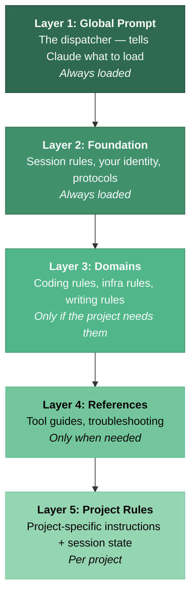
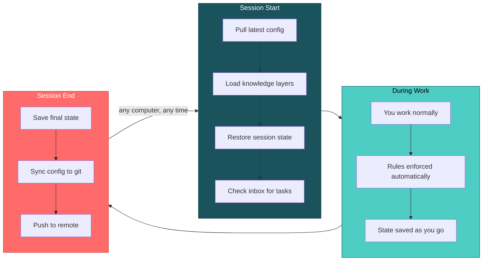
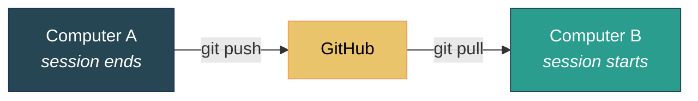

# Agent Fleet

**Multi-project, multi-machine configuration system for AI coding agents.**

Claude Code now has built-in memory — it remembers project patterns and preferences across sessions. That's a great foundation. But if you work across multiple projects, use multiple computers, or want Claude to follow domain-specific workflows, you need more structure.

This system adds:

- **Multi-project coordination** — projects pass tasks to each other via an inbox
- **Multi-machine sync** — close your laptop, open your desktop, same context (via git)
- **Layered knowledge** — domain rules (coding, infra, writing) load only when the project needs them
- **Session persistence** — structured state that survives crashes and context resets, with recovery instructions
- **Context rot protection** — auto-archival on `/clear`, unclean shutdown detection, live context usage meter
- **Self-healing protocols** — when Claude makes the same mistake twice, it auto-generates a rule to prevent it
- **MCP servers** — GitHub, Gmail, browser automation, diagrams, and more, pre-configured

---

## You Only Need Three Commands

```
cls     shut down cleanly, then /clear
end     shut down cleanly, then exit
lsd     project dashboard — list, switch, create projects
```

Type any of these as your entire message. No arguments, no syntax. `cls` and `end` run the full shutdown protocol (save state, archive session, commit, push) before clearing or exiting — so you never lose work. `lsd` shows a project dashboard with box-drawing tables grouped by priority tier, task counts from backlogs, and disk sizes. Data is pre-computed at session shutdown and cached — `lsd` reads the cache instantly, `lsd refresh` re-scans everything.

### Context Rot Awareness

Claude Code sessions degrade silently. The context window fills up, auto-compact fires, `/clear` wipes everything — and the next session starts blind. This system fights back:

| Protection | How |
|-----------|-----|
| **Continuous archival** | SessionEnd hooks auto-rotate session state to history — even on `/clear`, crashes, or unexpected exits. Whatever was on disk gets archived. |
| **Unclean shutdown detection** | SessionStart hooks detect when the previous session didn't shut down properly and warn Claude to review what was lost. |
| **Config health check** | SessionStart hooks validate symlink integrity, auto-pull config if behind remote, and clean up stale tool permissions from `settings.local.json`. |
| **Cross-project commit** | Session files in the current project get committed automatically at session end — not just the config repo. |
| **Live context meter** | Status line shows model name, context usage %, and kilotokens used — color-coded green/yellow/red so you know when to wrap up. |

The `cls`/`end` commands give you the **full cognitive shutdown** (cross-project coordination, curated decisions, strategy updates). The hooks give you the **mechanical safety net** when you forget or the session dies unexpectedly.

---

## Quick Start

### What you need

- **A computer** running Linux, macOS, or Windows with WSL
- **Claude Code** installed ([installation guide](https://docs.anthropic.com/en/docs/claude-code/getting-started))
- **git** installed (`sudo apt install git` on Ubuntu/WSL, `brew install git` on macOS)
- **Node.js 18+** installed (`sudo apt install nodejs npm` on Ubuntu/WSL, `brew install node` on macOS)
- **Python 3** (optional but recommended) — enhances setup and sync scripts. Most systems have it pre-installed.

### Windows users

Claude Code runs inside WSL (Windows Subsystem for Linux). If you haven't set up WSL yet:

1. Open PowerShell as Administrator
2. Run: `wsl --install`
3. Restart your computer
4. Open the "Ubuntu" app from your Start menu — this gives you a Linux terminal
5. Everything below happens inside that terminal

### Setup (5 minutes)

**1. Fork this repo** on GitHub (click the Fork button above), then:

```bash
git clone https://github.com/YOUR_USERNAME/agent-fleet ~/agent-fleet
cd ~/agent-fleet
bash setup.sh
```

**2. Answer a few questions** — your name, role, and how you like Claude to communicate.

**3. Optionally set up integrations** — the script asks about GitHub, Gmail, and other services. Skip any you don't need; you can add them later.

**4. Set up credentials** — Copy `secrets/vault.json.example` to `secrets/vault.json`, fill in your tokens, then encrypt with `bash secrets/vault-manage.sh encrypt`. Or configure MCP servers manually in `~/.mcp.json`.

**5. Done.** Open Claude Code in any project and it will automatically use your new configuration.

For a more detailed walkthrough, see the [Onboarding Guide](docs/onboarding-guide.md).

---

## What Changes After Setup

### Stock Claude Code

- Per-project auto memory and CLAUDE.md
- No connection between projects
- No sync between computers
- MCP servers configured per-project

### With this system

- Structured session state with crash recovery and handoff instructions
- Knowledge organized in 5 layers — domain rules load only when needed
- Projects pass tasks to each other via a cross-project inbox
- Config syncs across all your computers via git
- MCP servers configured once, work everywhere
- Domain protocols (TDD, publishing, infrastructure) enforce quality automatically
- Multiple personas with automatic context-based switching
- Config health checks at startup — symlinks, stale sessions, permission cleanup
- Test suite covering core infrastructure (session rotation, sync, dashboard, config checks)

---

## How It Works

You don't need to understand this to use it, but here's the architecture for the curious.

### 5 Knowledge Layers



The key idea: Claude doesn't load everything at once. A coding project loads coding rules. An infrastructure project loads server rules. This keeps Claude fast and focused.

### Multi-Persona System

You can define multiple named personalities — each with its own traits, communication style, and activation rules. For example, you might have a focused workhorse persona as the default and a warmer, encouraging persona that activates when you're frustrated.

Each persona has:
- **Name** — displayed as a bold prefix on responses (e.g., `**Atlas:**`)
- **Traits** — comma-separated style descriptors (efficient, dry-humor, warm, etc.)
- **Activation rule** — natural language describing when to switch (e.g., "when user is frustrated", "when discussing architecture")
- **Style** — free-text description of how this persona communicates

The default persona activates at session start. Others switch in automatically based on conversation context — Claude evaluates the activation rules against what's happening and switches when a rule matches. You can also force a switch by saying "switch to [Name]".

Personas are defined in `global/foundation/personas.md`. If you want a different personality on a specific machine (e.g., more concise on mobile), add a `## Persona` section to that machine's config file — it fully overrides the global personas for that device.

The active persona name is written to `~/.claude/.active-persona` so the statusline can display it.

The setup process offers to configure personas during onboarding — or you can skip it and add them later.

### Session Flow



This all happens automatically. You just use Claude normally.

---

## What's in the Box

### Directory Structure

```
agent-fleet/
│
├── setup.sh                       Run this first — sets everything up
├── sync.sh                        Keeps config in sync (automated by hooks)
├── registry.md                    List of your projects
│
├── global/
│   ├── CLAUDE.md                  The main prompt (the "dispatcher")
│   ├── foundation/                Core rules: sessions, identity, protocols, personas
│   ├── domains/                   Topic-specific rules (coding, infra, etc.)
│   ├── reference/                 Tool guides, troubleshooting docs
│   ├── knowledge/                 Operational tips (tool bugs, workarounds, recipes)
│   ├── machines/                  Per-computer configuration
│   └── hooks/                     SessionStart/End automation scripts
│
├── tests/
│   ├── run.sh                     Test runner (all suites)
│   └── test_*.sh                  Individual test suites
│
├── setup/
│   ├── install-base.sh            Phase 1: system deps, Node.js
│   ├── configure-claude.sh        Phase 2: MCP, launchers, hooks
│   ├── lib.sh                     Shared utilities (multi-distro detection)
│   ├── config/                    Template configs (.mcp.json, settings.json, statusline.sh)
│   └── scripts/                   Operational scripts (session rotation, config check, dashboard)
│
├── projects/
│   └── _example/rules/CLAUDE.md   Example project config
│
└── cross-project/
    ├── inbox.md                   Task passing between projects
    └── *-strategy.md              Shared state files
```

### Sync Tool (sync.sh)

| Command | What it does |
|---------|-------------|
| `bash sync.sh setup` | **Run once per computer.** Creates symlinks, installs hooks. |
| `bash sync.sh deploy` | Push config changes to live locations. Safe to repeat. |
| `bash sync.sh collect` | Pull changes from live locations back into the repo. |
| `bash sync.sh status` | Health check — shows what's linked, what's out of sync. |

### MCP Servers (pre-configured)

MCP servers let Claude interact with external services. Setup prompts you for each one.

| Server | What it does | Needs credentials? |
|--------|-------------|:------------------:|
| **GitHub** | Manage repos, issues, pull requests | Yes (PAT) |
| **Google Workspace** | Gmail, Google Docs, Calendar, Drive | Yes (OAuth) |
| **Twitter/X** | Post tweets | Yes (API keys) |
| **Jira** | Issues, sprints, Confluence | Yes (API token) |
| **PostgreSQL** | Database queries | Yes (connection URL) |
| **LinkedIn** | Create posts | Yes (OAuth, manual setup) |
| **Serena** | Navigate code semantically | No |
| **Playwright** | Automate browsers, take screenshots | No |
| **Memory** | Persistent knowledge graph | No |
| **Diagram** | Generate Mermaid diagrams (PNG/SVG/PDF) | No |

Skip any you don't need. You can add them later.

### Included Domains

Domains are topic-specific rule sets. Each project declares which ones it needs.

| Domain | What it teaches Claude |
|--------|----------------------|
| **Software Development** | Test-driven development, code review conventions |
| **Publications** | Markdown to PDF pipeline, content quality |
| **Engagement** | Community interaction, social media etiquette |
| **IT Infrastructure** | Server management, Docker, DNS, deployment |

Add your own: copy `global/domains/_template/`, edit it, reference it from your project's config.

### Operational Knowledge

`global/knowledge/` stores tool-specific tips, workarounds, and troubleshooting recipes — loaded conditionally when the relevant tool or situation is encountered. Unlike domains (which are broad rule sets declared per-project), knowledge files are narrow and actionable, growing organically from real debugging sessions. Examples: MCP deployment issues, permission prompt fixes, browser automation gotchas.

### Test Suite

The system includes a test suite (`tests/run.sh`) covering session rotation, git sync, config health checks, dashboard refresh, and more. TDD is enforced as a development rule — all new code and features require corresponding tests.

### Skill Collections (optional)

Third-party skill packs extend Claude Code with domain-specific capabilities. Skills are lightweight — only short descriptions load at startup, full context loads on demand.

| Collection | What it adds | Source |
|-----------|-------------|--------|
| **getsentry** | Sentry debugging skills | [getsentry/skills](https://github.com/getsentry/skills) |
| **obra** | Superpowers skill pack | [obra/superpowers](https://github.com/obra/superpowers) |
| **trailofbits** | Security analysis, static analysis, binary analysis | [trailofbits/skills](https://github.com/trailofbits/skills) |

Install all at once: `bash setup/scripts/install-skill-collections.sh`

---

## Customization Guide

After setup, customize these files first:

| File | What to change |
|------|---------------|
| `global/foundation/user-profile.md` | Your name, background, communication preferences |
| `global/CLAUDE.md` | Machine identity table (add your hostnames) |
| `global/reference/mcp-catalog.md` | Your MCP server accounts and tokens |
| `registry.md` | Add your projects |
| `global/domains/` | Enable/disable domain protocols per project |

The setup script handles most of this interactively. For fine-tuning, edit the files directly — changes take effect next session.

---

## Common Tasks

### Add a new project

Open Claude Code in any project directory. Tell it "set up this project" and it will:
- Create a project config file
- Add the project to the registry
- Set up session tracking

Or do it manually: create `<your-project>/.claude/CLAUDE.md` using the example in `projects/_example/rules/CLAUDE.md`.

### Set up a second computer

```bash
git clone YOUR_REPO_URL ~/agent-fleet
cd ~/agent-fleet
bash setup.sh
```

Same process. Your config syncs via git — push from one machine, pull on the other.

### Pass a task between projects

Add a line to `cross-project/inbox.md`:

```
- [ ] **target-project**: Description of what needs to happen
```

Next time Claude opens that project, it picks up the task automatically.

### Customize how Claude communicates

Edit `global/foundation/user-profile.md` with your preferences. Changes take effect next session.

---

## Multi-Machine Workflow



No computer is special. Clone the repo, run `setup.sh`, and any machine is a full participant.

### The sync cycle

1. **Session ends on Machine A** — hooks auto-commit config changes and push to GitHub
2. **Session starts on Machine B** — startup pulls latest config before loading anything
3. **Conflicts are rare** because each machine writes to its own machine file and session-context is per-session

### Setting up a new machine

```bash
git clone YOUR_REPO_URL ~/agent-fleet
cd ~/agent-fleet
bash setup.sh
```

The setup script detects your platform, creates machine-specific config, and links everything. Each machine gets its own file in `global/machines/` — no conflicts with other machines.

### What syncs vs. what's local

| Syncs via git | Stays local |
|---------------|-------------|
| Global rules (CLAUDE.md, foundation/) | `~/.mcp.json` (tokens differ per machine) |
| Domain protocols | `~/CLAUDE.local.md` (points to local machine file) |
| Session history | OAuth tokens and credentials |
| Cross-project inbox | Machine-specific tool paths |
| Project configs | |

---

## Platform Support

The setup scripts auto-detect your platform and install dependencies accordingly.

| Platform | Package Manager | Status |
|----------|----------------|:------:|
| **Ubuntu / Debian** | apt | Tested |
| **WSL (Windows)** | apt (inside WSL) | Tested |
| **Fedora / RHEL** | dnf | Tested |
| **Arch / SteamOS** | pacman | Tested |
| **macOS** | Homebrew | Supported |

**Windows users:** Claude Code runs inside WSL, not natively. See the Quick Start section for WSL setup.

**SteamOS note:** The immutable filesystem requires temporary unlock (`steamos-readonly disable`) during setup. The script handles this automatically and re-locks after installation.

**File opening:** `xdg-open` on Linux, `open` on macOS, `powershell.exe` on WSL.

**WSL tip:** Always work in the Linux filesystem (`~/`), not `/mnt/c/` — Windows paths are 10-15x slower.

---

## Security

**Never commit secrets.** API tokens, passwords, and credentials should NEVER appear in committed files.

### Where secrets go

| Secret type | Storage | Example |
|------------|---------|---------|
| MCP server tokens | `~/.mcp.json` (gitignored on your machine) | GitHub PAT, Google OAuth |
| Project-specific secrets | `.env` files (add to `.gitignore`) | Database URLs, API keys |
| Shared/portable secrets | Encrypted vault (`secrets/vault.json.enc`) | Tokens you need across machines |

### Vault setup (optional)

The `secrets/` directory supports an encrypted vault for portable credential storage:

```bash
# Create vault from example
cp secrets/vault.json.example secrets/vault.json
# Edit with your tokens
nano secrets/vault.json
# Encrypt (vault.json is gitignored; vault.json.enc is committed)
bash secrets/vault-manage.sh encrypt
# On another machine: decrypt and deploy tokens to MCP configs
bash secrets/vault-manage.sh deploy
```

### What to check before pushing

- `git diff --cached` — scan for tokens, passwords, API keys
- No `.env` files staged
- No plaintext vault files staged (`vault.json` should be gitignored)
- MCP config (`~/.mcp.json`) lives outside the repo

---

## Context Budget

The system uses approximately **30-40% of a 200k-token context window at session start**. Here's where it goes:

| Category | Est. tokens | Notes |
|----------|----------:|-------|
| Claude Code system prompt | ~15-20k | Built-in tools, agent descriptions (not controllable) |
| MCP tool schemas | ~3-5k | Active servers, deferred tool list |
| Global CLAUDE.md | ~3-5k | Loading rules, conventions, quick commands |
| Foundation files | ~2-3k | User profile, session protocol |
| MCP catalog (if used) | ~4k | Loaded via @import — server details, troubleshooting |
| Machine file | ~1k | Platform-specific state |
| Project CLAUDE.md | ~1-2k | Per-project manifest |
| Startup tool calls | ~5-15k | File reads, git pull, inbox check |
| **Total at startup** | **~35-55k** | **~18-28% of 200k** |

The exact percentage depends on how many MCP servers you configure and how large your CLAUDE.md files grow. With a minimal setup (2-3 MCP servers, short user profile), you'll be on the low end. With 10+ MCP servers and detailed machine files, closer to the high end.

**The key tradeoff:** More rules and context at startup = less room for conversation, but Claude makes fewer mistakes and needs fewer corrections (which also consume tokens). Finding the right balance depends on your workflow.

---

## Common Mistakes

**Editing files in the wrong place.** The repo (`~/agent-fleet/`) is the source of truth. Edit there, then `bash sync.sh deploy`. Don't edit the symlink targets directly in `~/.claude/` — those changes get overwritten.

**Forgetting to sync after changes.** After editing global rules or foundation files, run `bash sync.sh deploy` to push changes to live locations. Or let the session hooks handle it automatically.

**Overloading the global prompt.** `global/CLAUDE.md` is loaded into every session. Keep it lean — use domains for topic-specific rules and references for conditional loading. A bloated global prompt wastes context tokens.

**Storing rules in auto-memory.** Claude Code's built-in memory is per-project and not visible across projects. Persistent rules belong in `CLAUDE.md` files. Use auto-memory only for temporary project-specific orientation notes.

**Working in `/mnt/c/` on WSL.** Windows filesystem paths are 10-15x slower. Always work in the Linux filesystem (`~/`).

**Putting secrets in committed files.** API tokens go in `~/.mcp.json` (local) or the encrypted vault — never in CLAUDE.md, registry.md, or other tracked files.

---

## Troubleshooting

**Claude doesn't see my MCP servers** — Two common causes: (1) Restart Claude Code — MCP servers load at startup. (2) Check `settings.local.json` in the project's `.claude/` directory — if it has `enabledMcpjsonServers`, that list acts as a **whitelist** filtering ALL servers (including global ones). Add the missing server name to the list, or remove the key entirely.

**GitHub returns "Not Found" on private repos** — The env var must be `GITHUB_PERSONAL_ACCESS_TOKEN` (not `GITHUB_TOKEN`). Check `~/.mcp.json`.

**Permission prompts every session** — If Claude keeps asking to approve basic commands (git, bash, etc.), check the project's `.claude/settings.local.json` for a `permissions` block. Project-level permissions **replace** (not extend) global permissions. Remove the `permissions` block entirely — the global `settings.json` has comprehensive auto-approvals.

**Session state not persisting** — Make sure you're running Claude from a directory that has `session-context.md`, or from `~/agent-fleet/` itself.

**Symlinks broken after git pull** — Run `bash sync.sh setup` to recreate them.

**Something feels wrong** — Run `bash sync.sh status` for a health check.

---

## License

MIT — see [LICENSE](LICENSE).
